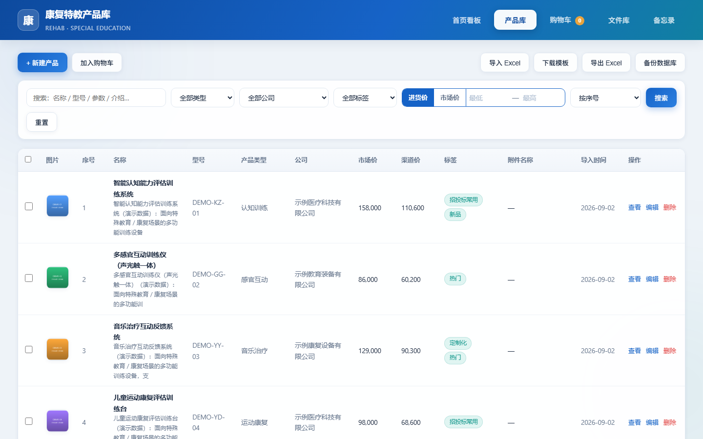
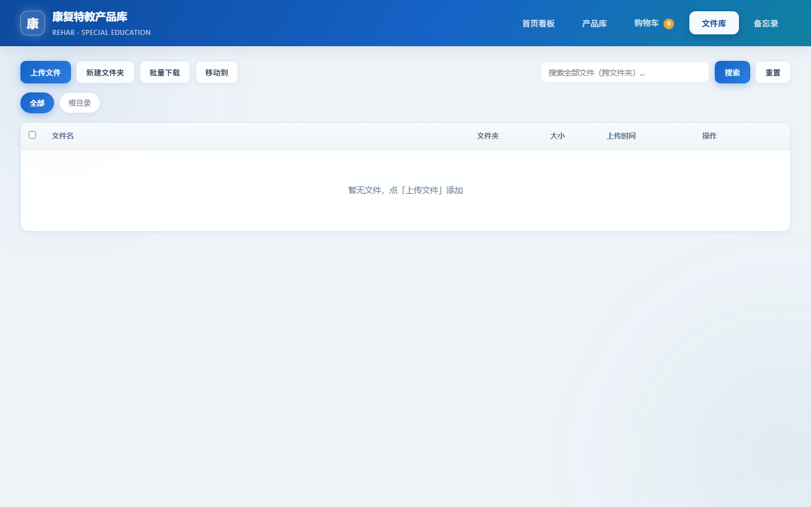

# 康复特教产品库 · Product Library

> 一站式管理康复器械、心理设备、特教云平台等产品的内部资料库，支持局域网多端协同共享。

[]()
[]()
[](LICENSE)

## 项目简介

面向 **康复设备 / 医疗器械 / 特殊教育** 等行业的产品库管理系统，适合经销商、产品经理、解决方案工程师在本地或局域网内做产品资料归集、查询、对比、方案报价、文件交付。

**核心特性**

- 🏠 **首页看板**：产品总数、分类、合作公司、标签统计 + 类型分布柱状图
- 📦 **产品库**：多维筛选（类型 / 公司 / 标签 / 价格区间）、全文搜索、按价格排序、批量加入购物车
- 🔍 **产品详情**：序号、名称、介绍、参数、型号、市场价、渠道价、标签、图片 / 附件预览
- 🖼️ **附件管理**：产品图集 + 单个文件附件，支持预览与下载
- 🗂️ **文件库**：独立的通用文件归集，支持按文件夹管理、批量下载 ZIP、批量移动
- 📊 **Excel 导入导出**：全量 / 筛选导出、内置模板下载，导入自动去重与按需建类
- 💾 **统计与备份**：首页看板 + 一键下载 SQLite 副本
- 🌐 **局域网共享**：绑定 `0.0.0.0`，任意设备输入 `http://<本机IP>:8000` 即可访问
- 💻 **离线运行**：无外部依赖，纯本地文件存储，SQLite 单文件库

## 界面预览

| 首页看板 | 产品库 |
| --- | --- |
|  |  |

| 文件库 | 产品库新建 / 编辑 |
| --- | --- |
|  | *见上方产品库截图* |

## 技术栈

| 层级 | 选型 |
| --- | --- |
| 后端 | [FastAPI](https://fastapi.tiangolo.com/) + [Uvicorn](https://www.uvicorn.org/) |
| 数据库 | SQLite 3 (WAL 模式) |
| 前端 | 原生 HTML + JavaScript + CSS（零构建） |
| Excel 读写 | [openpyxl](https://openpyxl.readthedocs.io/) |
| 占位图生成 | [Pillow](https://pillow.readthedocs.io/)（可选，仅首次生成演示数据时使用） |
| 部署 | 单机 / 局域网，Windows / macOS / Linux 全平台 |

## 目录结构

```
product-library/
├── app.py                       # FastAPI 应用主程序（所有 API 路由）
├── database.py                  # SQLite 连接与表结构
├── requirements.txt             # Python 依赖清单
├── run_server.py                # 启动入口（带端口占用检测）
├── start.bat                    # Windows 一键启动
├── data.db                      # SQLite 数据库（仓库附带演示数据）
├── static/                      # 前端页面（单页 + 看板 + 列表 + 文件库）
│   ├── index.html
│   ├── app.js
│   └── style.css
├── uploads/                     # 上传文件存储根目录
│   ├── images/                  # 产品图片（仓库附带演示图）
│   ├── files/                   # 产品附件（.gitignore 排除真实附件）
│   └── library/                 # 文件库文件（.gitignore 排除）
├── sample_data/                 # 演示数据生成脚本（可复现）
│   └── generate_demo_data.py
├── screenshots/                 # README 引用截图
│   ├── 01_dashboard.png
│   ├── 02_product_list.png
│   └── 03_library.png
├── README.md
├── LICENSE
└── .gitignore
```

## 快速开始

### 前置条件

- Python 3.8 及以上
- pip

### Windows

```bat
git clone https://github.com/<your-username>/product-library.git
cd product-library
python -m venv venv
venv\Scripts\activate
pip install -r requirements.txt
start.bat
```

或手动启动：

```bat
python run_server.py
```

### macOS / Linux

```bash
git clone https://github.com/<your-username>/product-library.git
cd product-library
python3 -m venv venv
source venv/bin/activate
pip install -r requirements.txt
python run_server.py
```

启动成功后浏览器访问：**http://127.0.0.1:8000**

### 局域网共享

`run_server.py` 已绑定 `0.0.0.0:8000`，同一局域网内其他设备可直接通过主机 IP 访问：

```
http://<主机IP>:8000
```

Windows 下查看本机 IP：`ipconfig`；macOS / Linux：`ifconfig` 或 `ip addr`。

## 使用指南

### 1. 首页看板

- 顶部 4 个统计卡片：产品总数、产品类型数、合作公司数、标签种类数
- 下方柱状图：产品类型分布（由 [Chart.js](https://www.chartjs.org/) 渲染）
- 顶部菜单在所有 tab 间通用

### 2. 产品库

顶部工具栏：

| 按钮 | 作用 |
| --- | --- |
| **新建产品** | 弹出表单，填名称 / 介绍 / 参数 / 型号 / 价格 / 类型 / 公司 / 联系人，支持选标签、上传图片与附件 |
| **加入购物车** | 选中行后批量加入（用于一次性导出） |
| **导入 Excel** | 上传 .xlsx 文件，自动解析表头并入库 |
| **下载模板** | 获取标准导入模板（含示例行） |
| **导出 Excel** | 按当前筛选条件导出 |
| **备份数据库** | 下载当前 `data.db` 副本 |

筛选区：关键词搜索、类型、公司、标签、进价 / 市价区间、价格排序、按序号。

表格行支持 **查看 / 编辑 / 删除**。

**重复校验**：同 `名称 + 公司 + 型号` 视为同一产品，避免重复录入。

### 3. 文件库

- 独立的通用文件归集区，适合存方案、PPT、合同等大文件
- 支持新建文件夹、批量下载为 ZIP、跨文件夹批量移动
- 与产品库完全解耦，不会污染产品数据

### 4. 备忘录

- 与文件库共用底层（`file` / `folder` 表）
- 用于记录会议要点、方案草稿等

## 数据导入 / 导出

### 模板下载

点击产品库顶部 **下载模板** 按钮，获得 `product_template.xlsx`，包含表头：

| 序号 | 名称 | 介绍 | 参数 | 型号 | 市场价 | 渠道价 | 产品类型 | 公司名称 | 联系方式 | 联系人 | 标签 |
| --- | --- | --- | --- | --- | --- | --- | --- | --- | --- | --- | --- |

- 表头名称必须与上表完全一致（中文），程序按名称匹配列
- 类型、公司不存在时自动新建
- 标签用顿号 / 逗号 / 分号 / 竖线分隔，自动切分

### 导出选项

- **导出 Excel** — 按当前筛选条件导出全部字段
- **筛选后导出** — 配合顶部筛选条，只导出当前可视范围

## API 文档摘要

后端是标准 FastAPI 应用，启动后访问 **http://127.0.0.1:8000/docs** 获得自动生成的交互式 API 文档。主要路由：

| 模块 | 路由 |
| --- | --- |
| 分类 | `GET / POST /api/categories` · `DELETE /api/categories/{id}` |
| 公司 | `GET / POST /api/companies` · `DELETE /api/companies/{id}` |
| 标签 | `GET / POST /api/tags` · `DELETE /api/tags/{id}` |
| 产品 | `GET / POST /api/products` · `GET / PUT / DELETE /api/products/{id}` |
| 附件 | `POST /api/products/{id}/attachments` · `GET /api/attachments/{id}/{raw,download}` · `DELETE /api/attachments/{id}` |
| 文件库 | `GET / POST /api/folders` · `GET / POST / DELETE /api/files[/{id}]` · `POST /api/files/batch-download` · `POST /api/files/batch-move` |
| 导入导出 | `GET /api/export` · `GET /api/export/template` · `POST /api/export/selected` · `POST /api/import` |
| 统计 | `GET /api/stats` |
| 备份 | `GET /api/backup` |

## 测试数据（附赠）

仓库自带一份**完全虚构**的演示数据，帮助你立刻看到效果：

- 16 个虚构产品（型号以 `DEMO-` 开头）
- 3 个示例厂商（全部以"示例"开头）
- 7 个产品类型、6 个标签
- 16 张彩色占位图（由 `Pillow` 实时生成，**不含任何真实图片**）

### 重新生成演示数据

```bash
python sample_data/generate_demo_data.py
```

如已有 `data.db` 会自动跳过；要重建请先删除 `data.db`。

### 替换为真实数据

任选其一：

1. 直接在前端录入
2. 导出模板 → 填好真实数据 → 导入 Excel
3. 删除 `data.db` → 重启服务 → 程序会创建空库

> ⚠️ **重要提示**：真实业务数据（渠道价、厂商联系方式）请勿提交到公开仓库。
> 仓库内的 `data.db` 仅作演示用，真实数据请在本地留档或私有仓库管理。

## 数据模型（SQLite）

| 表 | 主要字段 |
| --- | --- |
| `category` | id, name（唯一） |
| `company` | id, name（唯一） |
| `tag` | id, name（唯一） |
| `product` | seq, name, intro, params, model, market_price, channel_price, category_id, company_id, contact_phone, contact_person |
| `product_tag` | product_id, tag_id（联合主键） |
| `attachment` | product_id, filename, stored_name, kind(image/file), size |
| `file` | filename, stored_name, folder, size |
| `folder` | name（唯一） |

详见 [`database.py`](database.py)。

## 常见问题

**Q: 端口 8000 被占用怎么办？**
A: 编辑 `run_server.py` 把 `PORT = 8000` 改成其它端口。

**Q: 改了前端代码刷新没生效？**
A: 已配置 `no-cache` 中间件，普通刷新即可，无需重启服务。

**Q: 上传文件保存在哪里？**
A: `uploads/images/` 与 `uploads/files/` 在仓库 `.gitignore` 中已排除，真实附件不会污染仓库。

**Q: 数据库如何备份？**
A: 程序内 **备份数据库** 按钮直接下载 `data.db`；也可手动复制仓库根目录下的 `data.db` 到安全位置。

**Q: 如何重置全部数据？**
A: 停止服务 → 删除 `data.db` → 重启服务 → 程序会重新创建空库。

## 开源协议

本项目基于 [MIT License](LICENSE) 开源，欢迎自由使用与二次开发。

## 致谢

- 感谢 [FastAPI](https://fastapi.tiangolo.com/) / [Uvicorn](https://www.uvicorn.org/) / [openpyxl](https://openpyxl.readthedocs.io/) / [Pillow](https://pillow.readthedocs.io/) 等优秀开源项目
- 演示占位图由 Pillow 实时生成

---

> 截图与文档中的所有产品名称、型号、价格、厂商均为虚构示例，与任何真实厂商无关。
